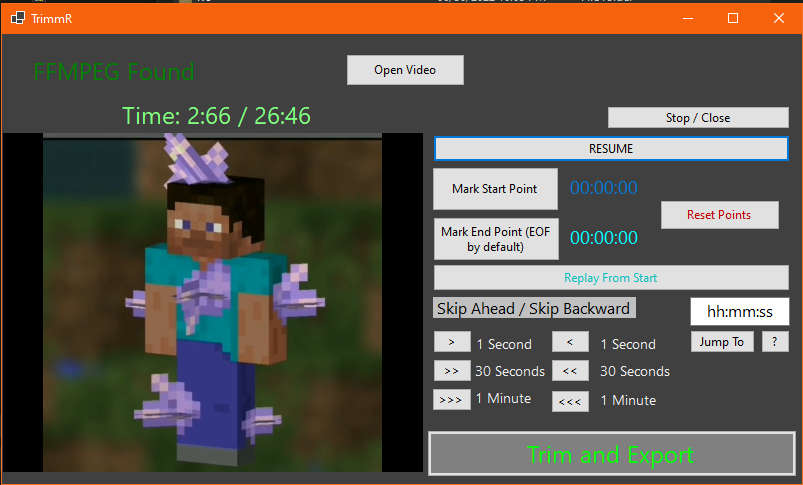

# TrimmR
A very simple video trimming tool, primarily for mp4 videos

### What is TrimmR?

TrimmR is a simple Windows Forms project that can render a seperate video file that is between two time points, essentially "trimming" a video file while leaving the original. 

### How does it work?

Once you have adjusted the starting and ending points in a video, TrimmR makes a call to FFmpeg to quickly make a trimmed down version of the video. (bundled with FFmpeg Autogen bindings. This software uses libraries from the FFmpeg project under the LGPLv2.1, and I claim no ownership of any files located under the "FFmpeg" directory. You can find binaries of FFmpeg [here](https://ffmpeg.org/) which will be needed to run this program ). 

### How can I use this?

Using TrimmR is simple. *To set up the program* you just need to clone this repository and open the project in Visual Studio or equivalent. Extract the FFmpeg.zip, and place your downloaded ffmpeg binaries in the extractd "FFmpeg" folder. This folder should be in the root project directory. Then just go back to your IDE and publish the program to an executable file. 

When you run the program, you will first want to **Press the "Open Video" button at the top of the screen.** Once you have chosen your video file, it will begin automatically playing in the window. Whenever you reach the starting point of where you want to trim, press **PAUSE** and then press **Mark Start Point**. Navigate to the end of the trim pressing **Mark End Point** after pausing respectively. Once you have your points chosen (you can not choose an ending point and Trimmr will instead continue to the end of the file) just press **Trim and Export**. 

### Why does this exist?

There was only one primary goal at the start -- something to work with the Instant Replay feature from [Geforce Experience](https://www.nvidia.com/en-us/geforce/geforce-experience/) . I really liked the ability to save the last 5 minutes of gameplay, but I never needed all 5 minutes to share. I wanted to make something quicker than going through a normal video editor or something like handbrake/vlc so I made TrimmR. 

If you intend to use TrimmR for the same purpose, I highly recommend adding the folder you publish the executable in to your environment path. 